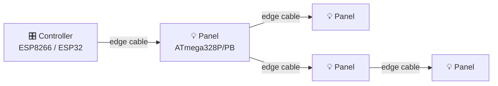

# 1. Build the hardware

A Lightnet installation has two kinds of boards: **one controller** and **one or more panels**. They are designed and flashed independently, then connected with a small cable that carries power and a single discovery wire.

Each edge cable carries:

- **Power** (V+ / GND) to the next panel
- **I²C** (SDA / SCL) — the shared bus used for all commands after discovery
- **A single-wire ping line** — used once at boot so the controller can map the topology

Panels expose **0–3 edges**. One edge is the "parent" connection (back toward the controller); the others fan out to children. Topology is a tree — no cycles.

---

## What you need

!!! warning "DIY status"
    Schematics, PCB layouts, and a full bill of materials are not yet published. This section will fill in once boards are released. For now, [the firmware repository](https://github.com/przemczan/lightnet-firmware) is the authoritative reference for pin assignments and target MCUs.

### Controller — pick one

| MCU | PlatformIO env | Notes |
|---|---|---|
| **ESP8266** (e.g. ESP-12E) | `controller_esp8266` | Lowest cost; single-core; works for typical installs |
| **ESP8266** (Wemos D1 Mini Pro) | `controller_wemos` | Same chip, larger antenna option |
| **ESP32 DevKit** | `controller_esp32` | More headroom for large installs; preferred if you can pick |

Pin assignments are documented in the [Firmware → Hardware](../lightnet-firmware/hardware.md) reference.

### Panels — one ATmega per panel

| MCU | PlatformIO env | Notes |
|---|---|---|
| **ATmega328PB** | `panel_atmega328pb` | Recommended — extra peripherals, identical footprint to 328P |
| **ATmega328P** | `panel_atmega328p` | Drop-in alternative; same flash, same firmware |
| **Arduino Nano (ATmega328)** | `panel_nanoatmega328` | Useful for breadboard prototyping via the controller's serial bridge |

Each panel drives **one WS2812 LED** on `PD5`. The bootloader, fuses, and firmware are flashed once over a programmer (USBasp), then panels receive future updates wirelessly via the controller. See [Firmware → OTA & Updates](../lightnet-firmware/ota.md).

### Other parts

- A **USBasp** (or compatible AVR programmer) to put the bootloader + fuses on each panel for the first time
- A **USB-to-serial cable** to flash the controller initially (over-the-air takes over once Wi-Fi is configured)
- A regulated **5 V supply** sized for your panel count

---

## Topology rules

- Panels form a **tree** rooted at the controller — no rings or cross-links
- A panel always has exactly **one parent edge**; the remaining 0–2 edges can fan out
- Panels are identified by an index assigned during discovery (tree-traversal order)
- The firmware caps a single controller at **100 panels** (`LIGHTNET_MAX_PANELS`)

Keep cable runs short enough that the I²C bus stays clean — long runs and high panel counts will eventually start dropping frames. The architecture details in [Firmware → Architecture](../lightnet-firmware/architecture.md) cover the bus characteristics.

---

[:material-arrow-right: Next: Prepare your tools](toolchain.md){ .md-button .md-button--primary }
