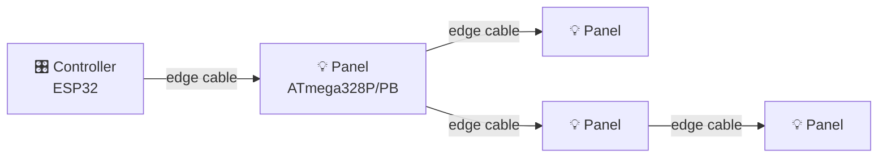

# 1. Build the hardware

A Lightnet installation has two kinds of boards: **one controller** and **one or more panels**. They are designed and flashed independently, then connected with a small cable that carries power and a single discovery wire.

```mermaid
graph LR
  C["🎛️ Controller<br/>ESP32"] -->|edge cable| P1["💡 Panel<br/>ATmega328P/PB"]
  P1 -->|edge cable| P2["💡 Panel"]
  P1 -->|edge cable| P3["💡 Panel"]
  P3 -->|edge cable| P4["💡 Panel"]
```

Each edge cable carries:

- **Power** (V+ / GND) to the next panel
- **UART** (TX / RX) — a point-to-point serial link to that one neighbour, used for both discovery and all runtime traffic. There's no shared bus and no separate ping/handshake phase: every panel is a store-and-forward repeater that only ever talks to its own physical neighbours.

Panels expose **up to 5 edges** (configurable via `NUMBER_OF_EDGES` in `panel.config.hpp`; current hardware wires 3). One edge is the "parent" connection (back toward the controller); the others fan out to children. Topology is a tree — no cycles.

---

## What you need

!!! warning "DIY status"
    Schematics, PCB layouts, and a full bill of materials are not yet published. This section will fill in once boards are released. For now, [the firmware repository](https://github.com/przemczan/lightnet-firmware) is the authoritative reference for pin assignments and target MCUs.

### Controller

| MCU | PlatformIO env | Notes |
|---|---|---|
| **ESP32 DevKit** | `controller_esp32` | Standard controller board |
| **ESP32-S2** (Lolin S2 Mini) | `controller_s2_mini` | Smaller footprint alternative |

Pin assignments are documented in the [Firmware → Hardware](../lightnet-firmware/hardware.md) reference.

### Panels — one ATmega per panel

| MCU | PlatformIO env | Notes |
|---|---|---|
| **ATmega328PB** | `panel_atmega328pb` | Recommended — extra peripherals, identical footprint to 328P |
| **ATmega328P** | `panel_atmega328p` | Drop-in alternative; same flash, same firmware |
| **ATmega328P (via controller serial)** | `panel_atmega328p_via_controller` | Upload a `.bin` over the controller's 57600-baud USB serial — useful for breadboard prototyping |

Each panel drives **one WS2812 LED** on `PD5`. The bootloader, fuses, and firmware are flashed once over a programmer (USBasp), then panels receive future updates wirelessly via the controller. See [Firmware → OTA & Updates](../lightnet-firmware/ota.md).

### Other parts

- A **USBasp** (or compatible AVR programmer) to put the bootloader + fuses on each panel for the first time
- A **USB-to-serial cable** to flash the controller initially (over-the-air takes over once Wi-Fi is configured)
- A regulated **5 V supply** sized for your panel count

---

## Topology rules

- Panels form a **tree** rooted at the controller — no rings or cross-links
- A panel always has exactly **one parent edge**; the remaining 0–4 edges can fan out
- Panels are identified by an index assigned during discovery (tree-traversal order)
- The firmware caps panel count at **100** (`LIGHTNET_MAX_PANELS` in `Core/Common/LightnetConfig.hpp`)

Every inter-panel link is a point-to-point UART hop, so what scales with tree size is **hop count (depth)**, not bus contention — each hop's transit time accumulates across the depth. The architecture details in [Firmware → Architecture](../lightnet-firmware/architecture.md) cover the relay protocol.

---

[:material-arrow-right: Next: Prepare your tools](toolchain.md){ .md-button .md-button--primary }
