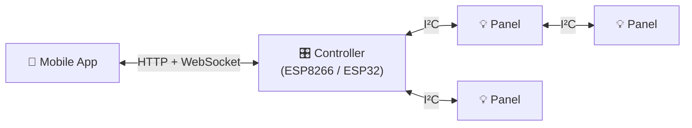

# Lightnet Documentation

Welcome to the Lightnet developer documentation. This site covers everything you need to understand, build, and deploy Lightnet firmware and mobile applications.

## What is Lightnet?

Lightnet is a modular addressable lighting system built on a hierarchical architecture with a controller and multiple addressable panels. The controller manages animations, exposes WiFi APIs, and drives panels over I²C. Panels execute animations locally with zero per-frame traffic after a single setup packet.

---

-   :material-chip: **Firmware**

    ---

    Controller and panel firmware for ESP8266/ESP32 and ATmega. Covers build toolchain, hardware wiring, I²C protocol, animation system, and OTA updates.

    [:material-arrow-right: Firmware Overview](lightnet-firmware/overview.md)

-   :material-cellphone: **Mobile**

    ---

    Kotlin Multiplatform app for Android and iOS. Covers the binary WebSocket protocol, device discovery via mDNS, and the Compose Multiplatform UI.

    [:material-arrow-right: Mobile Overview](lightnet-mobile/overview.md)

-   :material-book-open-variant: **Reference**

    ---

    Cross-cutting topics for all developers — key terminology, frequently asked questions, and version history.

    [:material-arrow-right: Glossary](reference/glossary.md)

---

## License

Lightnet firmware and mobile app are open source, released under the [GNU General Public License v3.0](https://www.gnu.org/licenses/gpl-3.0.html).

---

## Support the Project

Lightnet is a free, open project. If it saved you some time or you just enjoy using it, a small ETH tip is a nice way to say thanks — no pressure at all.

**ETH:** `0x6eb7Ac0FBc7bD95595Eb221681CC2Ba7aeDfd54D`
