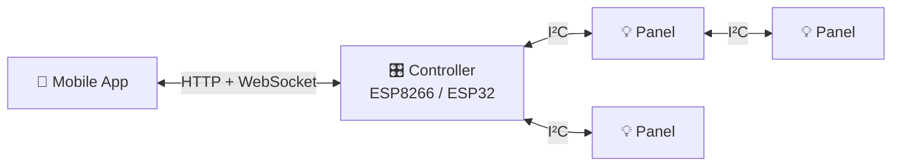

    

 

**A modular, DIY, addressable lighting system.** One controller, many panels, a tree of cables — and a small, fast firmware that keeps every panel in sync with sub-millisecond reactive triggers.

The controller handles Wi-Fi, the HTTP and WebSocket APIs, scene playback, and discovery. Each panel runs animations entirely on its own ATmega after a single setup packet — no per-frame traffic until something changes.

---

## What do you want to do?

-   :material-tools: **Build one**

    ---

    You're starting from nothing — boards, firmware, Wi-Fi setup, the lot. Follow the guided path end-to-end.

    [:material-arrow-right: Get started](getting-started/index.md)

-   :material-cellphone: **Use one**

    ---

    Someone already built the hardware; you just need the app and a power outlet.

    [:material-arrow-right: Use the app](getting-started/using-the-app.md)

-   :material-code-tags: **Develop on it**

    ---

    Read the firmware internals, the binary protocol, or the Kotlin Multiplatform app codebase.

    [:material-arrow-right: Firmware](lightnet-firmware/index.md) · [:material-arrow-right: App](lightnet-mobile/index.md)

---

## What's in the box

-   :material-chip: __Firmware__

    Controller and panel firmware for ESP8266/ESP32 and ATmega328P/PB. PlatformIO build, HTTP + WebSocket APIs, scene system, panel OTA.

    [:material-arrow-right: Firmware docs](lightnet-firmware/index.md)

-   :material-cellphone: __Mobile app__

    Kotlin Multiplatform app for Android and iOS. mDNS discovery, binary WebSocket protocol, Compose UI with a live panel visualiser.

    [:material-arrow-right: App docs](lightnet-mobile/index.md)

-   :material-book-open-variant: __Reference__

    Glossary, FAQ, and release notes — the shared vocabulary across firmware and app.

    [:material-arrow-right: Reference](reference/index.md)

---

## License & contributing

Both firmware and the app are open source under [GNU GPL v3.0](https://www.gnu.org/licenses/gpl-3.0.html). Source lives in three repositories:

- [:fontawesome-brands-github: przemczan/lightnet](https://github.com/przemczan/lightnet) — this hub
- [:fontawesome-brands-github: przemczan/lightnet-firmware](https://github.com/przemczan/lightnet-firmware) — firmware
- [:fontawesome-brands-github: przemczan/lightnet-mobile](https://github.com/przemczan/lightnet-mobile) — mobile app

Issues and PRs welcome on all three.

---

## Support the project

Lightnet is a free, open project. If it saved you some time or you just enjoy using it, a small ETH tip is a nice way to say thanks — no pressure at all.

**ETH:** `0x6eb7Ac0FBc7bD95595Eb221681CC2Ba7aeDfd54D`
